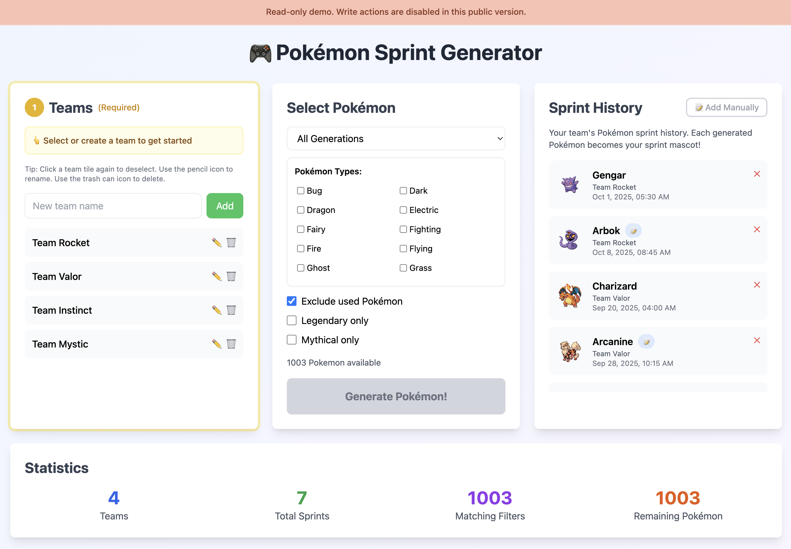

# Pokémon Sprint Name Generator (Public Demo)


A public, read-only version of the internal **Pokémon Sprint Name Generator** I originally built to make sprint planning more engaging for engineering teams.

This demo is designed to be safe to publish: it runs as a static site, loads demo data from JSON, and intentionally disables write operations. Forks can enable persistence by configuring their own Firebase project and rules.

> Read-only demo: write features are intentionally disabled in this repository and in the hosted demo

## Screenshot



## Overview

The app generates sprint names using data from the [PokéAPI](https://pokeapi.co/) and generates randomized names directly in the browser.

In this public demo, teams and sprint history are loaded from local JSON files and all **write actions** (e.g., saving, renaming, deleting) are disabled in this version to prevent misuse. Forks of the project can re-enable them by changing the configuration and rules in Firebase.

## Project Structure

```
pokemon-sprint-generator/
├── public/
│   ├── data/
│   │   ├── teams.json
│   │   └── sprint_history.json
│   ├── config.example.js
│   ├── index.html
│   └── ...
├── docs/
│   └── images/
│       └── app.png
├── .github/
│   ├── ISSUE_TEMPLATE/
│   └── pull_request_template.md
├── firebase.json
├── firestore.rules
├── LICENSE
└── README.md
```

## Quickstart (no Firebase required)

This repo runs as a static site. Demo mode uses PokéAPI plus local JSON data under `public/data/`.

1. **Clone the repository**

   ```bash
   git clone https://github.com/akikoiwamizu/pokemon-sprint-generator.git
   cd pokemon-sprint-generator
   ```

2. **Copy the example config**

   ```bash
   cp public/config.example.js public/config.js
   ```

3. **Serve locally**

   ```bash
   python3 -m http.server 8080
   ```

   Then open [http://localhost:8080](http://localhost:8080).

4. **Try it out**

   You should see a list of demo teams and a sample sprint history.

   - First select a team
   - Click **Generate** to create a new sprint name
   - Attempting a write action will show a read-only alert

## Demo Data Files

The public demo uses static JSON so it can run without a database:

- `public/data/teams.json`
- `public/data/sprint_history.json`

Forks can replace these files with their own internal data or switch to Firestore for persistence.

## Team Mode & Enabling Writes

**Team Mode** lets you pick a team (for example, “Team Rocket”) so sprint names and sprint history are assigned and grouped by team.
In the public demo, teams and history are read from JSON files. In a fork, Team Mode can be backed by Firestore for persistence.

If you want internal persistence, connect your fork to Firebase using the following steps:

1. Create a Firebase project

2. Enable Firestore (and Authentication if you want authenticated access)

3. Add your Firebase web config to `public/config.js`:

   ```bash
   cp public/config.example.js public/config.js
   ```

4. Enable writes in your fork configuration:

   ```js
   window.demo = { allowWrites: true, useFirebase: true };
   ```

5. Update Firestore rules in your Firebase project to allow authenticated writes you need

6. Deploy your rules (optional, if using this repo’s `firestore.rules` as a starting point):

   ```bash
   firebase deploy --only firestore
   ```

Example Firestore documents (one possible approach):

```json
teams/{teamId} -> { "teamName": "Team Rocket", "createdAt": "2025-10-01T00:00:00Z" }
sprint_history/{historyId} -> { "teamId": "team-rocket", "sprintName": "gengar", "generatedAt": "2025-11-05T00:00:00Z" }
```

## Security notes

This public repository is intentionally structured to be safe to publish:

- No production keys are committed
- `public/config.js` is local-only (create it from `config.example.js`)
- Write operations are blocked by default
- Demo data lives in static JSON files under `public/data/`

If you enable Firebase in a fork, use least-privilege rules and require authentication for writes.

## Why a Public Demo

Moving this project from private to public was an intentional design exercise focused on:

- Security-conscious publishing (disabling writes, avoiding secrets)
- Developer onboarding (self-contained local setup)
- Clear documentation for readers unfamiliar with Firebase
- Portfolio storytelling that demonstrates open-source release discipline

## Contributing

Issues and PRs are welcome.

- Bug reports: please include repro steps and screenshots if relevant
- Feature requests: describe the intended behavior and why it matters
- Security: if you notice a security concern, please open an issue with details (avoid posting secrets)

## Legal Notice

Pokémon and Pokémon character names are trademarks of Nintendo, Creatures Inc., and Game Freak Inc.

This project is non-commercial and uses data from [PokéAPI](https://pokeapi.co/) for educational and demonstration purposes.

No official Pokémon media or proprietary assets are included.

## License

Released under the [MIT License](./LICENSE).
